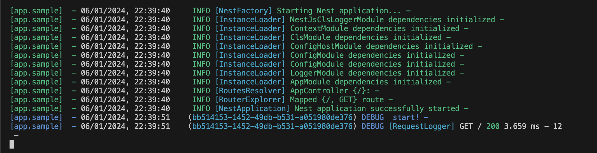

## NestJS CLS Logger

> Thanks very much for the excellent content below:

- [Logging on NestJS like a Pro with Correlation IDs, Log Aggregation, Winston, Morgan and more](https://medium.com/@jose-luis-navarro/logging-on-nestjs-like-a-pro-with-correlation-ids-log-aggregation-winston-morgan-and-more-d03e3bb56772)

- [nestjs-cls](https://github.com/Papooch/nestjs-cls)

This is a simplified version of NestJS CLS Logger. Implementing console logging functionality while tracing the processing flow through Correlation IDs.

Also capable of sending 'fatal' and 'emergency' level information to a specified Slack webhook in the production environment

## Install

```bash
npm i nestjs-cls-logger
```

## Detailed usage examples

1. Create a sample nestjs app

```bash
# install nest cli
npm i -g @nestjs/cli

# create sample app
nest new sample-app
cd sample-app
```

2. Install this npm

```bash
npm i nestjs-cls-logger
```

3. Import LoggerModule into AppModule

```ts
// ./src/app.module.ts

import { Module } from '@nestjs/common';
import { AppController } from './app.controller';
import { AppService } from './app.service';
import { NestJsClsLoggerModule } from 'nestjs-cls-logger';

@Module({
  imports: [NestJsClsLoggerModule.forRoot({ tag: 'app.sample' })],
  // imports: [NestJsClsLoggerModule.forRoot({ tag: 'app.sample', overrideConsole: true })]
  controllers: [AppController],
  providers: [AppService],
})
export class AppModule {}
```

4. Regist logger at bootstrap()

```ts
// ./src/main.ts

import { NestFactory } from '@nestjs/core';
import { AppModule } from './app.module';
import { NestjsLoggerServiceAdapter } from 'nestjs-cls-logger';

async function bootstrap() {
  const app = await NestFactory.create(AppModule, { bufferLogs: true });
  app.useLogger(app.get(NestjsLoggerServiceAdapter));
  await app.listen(3000);
}
bootstrap();
```

5. Use Logger in Service

```ts
// ./src/app.service.ts

import { Injectable } from '@nestjs/common';
import { LoggerService } from 'nestjs-cls-logger';

@Injectable()
export class AppService {
  constructor(private readonly logger: LoggerService) {}

  getHello(): string {
    this.logger.debug('start!');
    return 'Hello World!';
  }
}
```

6. Start & refresh [localhost:3000](http://localhost:3000)

```bash
npm run start:dev
```

7. Console should have the following output:



## Release Notes

## 1.1.3

- Bugfix: correct output of Props

## 1.1.2

- Disable colorization by default
- Remove last newline of morgan message

## 1.1.0

- Option to override console

## 1.0.0

- Initial release.
